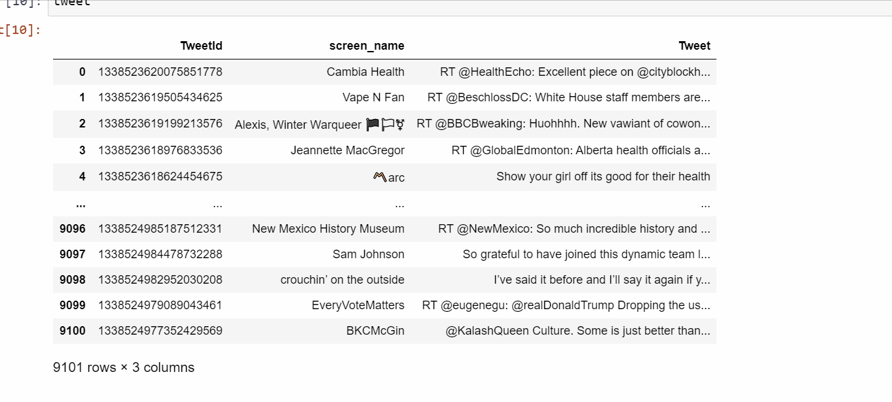

# Clasification-des-Tweets

Aujourd’hui, Twitter est utilisé par des centaines de millions de personnes dans le monde entier. Plus précisément, l’estimation actuelle s’élève à environ 330 millions d’utilisateurs actifs mensuels et 145 millions d’utilisateurs actifs quotidiens sur Twitter. Autre chiffre intéressant : 63 % des utilisateurs de Twitter dans le monde ont entre 35 et 65 ans.

L’objectif de ce projet est de réaliser une analyse exploratoire et visuelle des tweets présents dans notre jeu de données. Dans un second temps, le but sera de parvenir à classifier à l’aide de différents modèles disponibles en Python. Autrement dit réunir sentiment analysis et NLP.

 Pour cela 3 étapes pour faire Classification des Tweets: 
 
# - Prétraitement des tweets:
Dans cette étape, l’objectif est d’éliminer le texte inutile des tweets tels que les #, les noms des utilisateurs,les url, ...
# - Traitement des tweets: NLP (Natural LanguageProcessing):
On doit procéder à l’analyse du tweet en respectant les différentes étapes du NLP (Natural LanguageProcessing). La bibliothèque à utiliser est NLTK en Python.
# - Classification des tweets:
Etant donné un ensemble de tweets, l’objectif est de les résumer sous formes de groupes de sorte à ce que les Tweets qui sont dans le même groupe soient similaires. Ainsi, l’utilisateur pourra par la suite lire juste un Tweet de chaque groupe (le Tweet qui est le centroïde de groupes). 

# CONCLUSION:
A travers ce projet, nous avons pu encore une fois nous  rendre compte de la puissance du NLP qui a permis de classifier de manières fiable le sentiment des tweets. Cette analyse de sentiments Twitter pourrait avoir plusieurs domaines d’application dont voici quelques exemples spécifiques : 

-La surveillance des médias sociaux : Détecter les tweets à sentiments négatifs pourrait permettre de réduire le harcèlement et le déferlement de violence se produisant sur Twitter
-Campagnes politiques : L’analyse des sentiments sur Twitter pourrait permettre d’analyser la popularité d’un candidat politique et de prédire ainsi le vainqueur d’une élection présidentielle par exemple
F-idéliser la clientèle d’une entreprise : L’analyse des sentiments sur Twitter permet de suivre ce qui se dit à propos d’un produit ou service vendu par une entreprise et peut ainsi aider à détecter les clients en colère. L’entreprise pourra ainsi. 

